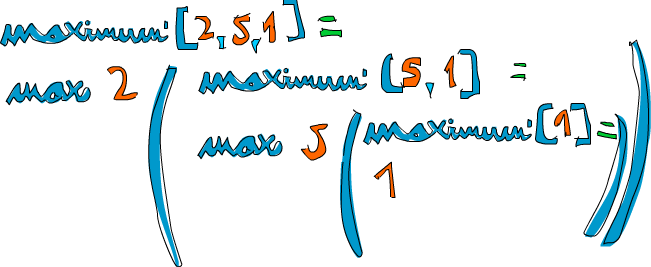
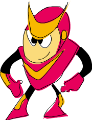
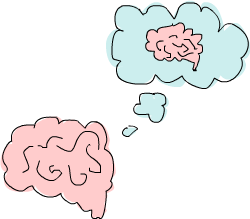

Recursion {style="margin-left:-2px"}
=========

Hello recursion!
----------------

We mention recursion briefly in the previous chapter. In this chapter,
we'll take a closer look at recursion, why it's important to Haskell and
how we can work out very concise and elegant solutions to problems by
thinking recursively.

If you still don't know what recursion is, read this sentence. Haha!
Just kidding! Recursion is actually a way of defining functions in which
the function is applied inside its own definition. Definitions in
mathematics are often given recursively. For instance, the fibonacci
sequence is defined recursively. First, we define the first two
fibonacci numbers non-recursively. We say that *F(0) = 0* and *F(1) =
1*, meaning that the 0th and 1st fibonacci numbers are 0 and 1,
respectively. Then we say that for any other natural number, that
fibonacci number is the sum of the previous two fibonacci numbers. So
*F(n) = F(n-1) + F(n-2)*. That way, *F(3)* is *F(2) + F(1)*, which is
*(F(1) + F(0)) + F(1)*. Because we've now come down to only
non-recursively defined fibonacci numbers, we can safely say that *F(3)*
is 2. Having an element or two in a recursion definition defined
non-recursively (like *F(0)* and *F(1)* here) is also called the *edge
condition* and is important if you want your recursive function to
terminate. If we hadn't defined *F(0)* and *F(1)* non recursively, you'd
never get a solution any number because you'd reach 0 and then you'd go
into negative numbers. All of a sudden, you'd be saying that *F(-2000)*
is *F(-2001) + F(-2002)* and there still wouldn't be an end in sight!

Recursion is important to Haskell because unlike imperative languages,
you do computations in Haskell by declaring what something *is* instead
of declaring *how* you get it. That's why there are no while loops or
for loops in Haskell and instead we many times have to use recursion to
declare what something is.

Maximum awesome
---------------

The `maximum`{.fixed} function takes a list of things that can be
ordered (e.g. instances of the `Ord`{.fixed} typeclass) and returns the
biggest of them. Think about how you'd implement that in an imperative
fashion. You'd probably set up a variable to hold the maximum value so
far and then you'd loop through the elements of a list and if an element
is bigger than then the current maximum value, you'd replace it with
that element. The maximum value that remains at the end is the result.
Whew! That's quite a lot of words to describe such a simple algorithm!

Now let's see how we'd define it recursively. We could first set up an
edge condition and say that the maximum of a singleton list is equal to
the only element in it. Then we can say that the maximum of a longer
list is the head if the head is bigger than the maximum of the tail. If
the maximum of the tail is bigger, well, then it's the maximum of the
tail. That's it! Now let's implement that in Haskell.

~~~~ {.haskell:hs name="code"}
maximum' :: (Ord a) => [a] -> a
maximum' [] = error "maximum of empty list"
maximum' [x] = x
maximum' (x:xs) 
    | x > maxTail = x
    | otherwise = maxTail
    where maxTail = maximum' xs
~~~~

As you can see, pattern matching goes great with recursion! Most
imperative languages don't have pattern matching so you have to make a
lot of if else statements to test for edge conditions. Here, we simply
put them out as patterns. So the first edge condition says that if the
list is empty, crash! Makes sense because what's the maximum of an empty
list? I don't know. The second pattern also lays out an edge condition.
It says that if it's the singleton list, just give back the only
element.

Now the third pattern is where the action happens. We use pattern
matching to split a list into a head and a tail. This is a very common
idiom when doing recursion with lists, so get used to it. We use a
*where* binding to define `maxTail`{.fixed} as the maximum of the rest
of the list. Then we check if the head is greater than the maximum of
the rest of the list. If it is, we return the head. Otherwise, we return
the maximum of the rest of the list.

Let's take an example list of numbers and check out how this would work
on them: `[2,5,1]`{.fixed}. If we call `maximum'`{.fixed} on that, the
first two patterns won't match. The third one will and the list is split
into `2`{.fixed} and `[5,1]`{.fixed}. The *where* clause wants to know
the maximum of `[5,1]`{.fixed}, so we follow that route. It matches the
third pattern again and `[5,1]`{.fixed} is split into `5`{.fixed} and
`[1]`{.fixed}. Again, the `where`{.fixed} clause wants to know the
maximum of `[1]`{.fixed}. Because that's the edge condition, it returns
`1`{.fixed}. Finally! So going up one step, comparing `5`{.fixed} to the
maximum of `[1]`{.fixed} (which is `1`{.fixed}), we obviously get back
`5`{.fixed}. So now we know that the maximum of `[5,1]`{.fixed} is
`5`{.fixed}. We go up one step again where we had `2`{.fixed} and
`[5,1]`{.fixed}. Comparing `2`{.fixed} with the maximum of
`[5,1]`{.fixed}, which is `5`{.fixed}, we choose `5`{.fixed}.

An even clearer way to write this function is to use `max`{.fixed}. If
you remember, `max`{.fixed} is a function that takes two numbers and
returns the bigger of them. Here's how we could rewrite
`maximum'`{.fixed} by using `max`{.fixed}:

~~~~ {.haskell:hs name="code"}
maximum' :: (Ord a) => [a] -> a
maximum' [] = error "maximum of empty list"
maximum' [x] = x
maximum' (x:xs) = max x (maximum' xs)
~~~~

How's that for elegant! In essence, the maximum of a list is the max of
the first element and the maximum of the tail.

A few more recursive functions
------------------------------

Now that we know how to generally think recursively, let's implement a
few functions using recursion. First off, we'll implement
`replicate`{.fixed}. `replicate`{.fixed} takes an `Int`{.fixed} and some
element and returns a list that has several repetitions of the same
element. For instance, `replicate 3 5`{.fixed} returns
`[5,5,5]`{.fixed}. Let's think about the edge condition. My guess is
that the edge condition is 0 or less. If we try to replicate something
zero times, it should return an empty list. Also for negative numbers,
because it doesn't really make sense.

~~~~ {.haskell:hs name="code"}
replicate' :: (Num i, Ord i) => i -> a -> [a]
replicate' n x
    | n <= 0    = []
    | otherwise = x:replicate' (n-1) x
~~~~

We used guards here instead of patterns because we're testing for a
boolean condition. If `n`{.fixed} is less than or equal to 0, return an
empty list. Otherwise return a list that has `x`{.fixed} as the first
element and then `x`{.fixed} replicated n-1 times as the tail.
Eventually, the `(n-1)`{.fixed} part will cause our function to reach
the edge condition.

*Note:* `Num`{.fixed} is not a subclass of `Ord`{.fixed}. That means
that what constitutes for a number doesn't really have to adhere to an
ordering. So that's why we have to specify both the `Num`{.fixed} and
`Ord`{.fixed} class constraints when doing addition or subtraction and
also comparison.

Next up, we'll implement `take`{.fixed}. It takes a certain number of
elements from a list. For instance, `take 3 [5,4,3,2,1]`{.fixed} will
return `[5,4,3]`{.fixed}. If we try to take 0 or less elements from a
list, we get an empty list. Also if we try to take anything from an
empty list, we get an empty list. Notice that those are two edge
conditions right there. So let's write that out:

~~~~ {.haskell:hs name="code"}
take' :: (Num i, Ord i) => i -> [a] -> [a]
take' n _
    | n <= 0   = []
take' _ []     = []
take' n (x:xs) = x : take' (n-1) xs
~~~~

The first pattern specifies that if we try to take a 0 or negative
number of elements, we get an empty list. Notice that we're using
`_`{.fixed} to match the list because we don't really care what it is in
this case. Also notice that we use a guard, but without an
`otherwise`{.fixed} part. That means that if `n`{.fixed} turns out to be
more than 0, the matching will fall through to the next pattern. The
second pattern indicates that if we try to take anything from an empty
list, we get an empty list. The third pattern breaks the list into a
head and a tail. And then we state that taking `n`{.fixed} elements from
a list equals a list that has `x`{.fixed} as the head and then a list
that takes `n-1`{.fixed} elements from the tail as a tail. Try using a
piece of paper to write down how the evaluation would look like if we
try to take, say, 3 from `[4,3,2,1]`{.fixed}.

`reverse`{.fixed} simply reverses a list. Think about the edge
condition. What is it? Come on ... it's the empty list! An empty list
reversed equals the empty list itself. O-kay. What about the rest of it?
Well, you could say that if we split a list to a head and a tail, the
reversed list is equal to the reversed tail and then the head at the
end.

~~~~ {.haskell:hs name="code"}
reverse' :: [a] -> [a]
reverse' [] = []
reverse' (x:xs) = reverse' xs ++ [x]
~~~~

There we go!

Because Haskell supports infinite lists, our recursion doesn't really
have to have an edge condition. But if it doesn't have it, it will
either keep churning at something infinitely or produce an infinite data
structure, like an infinite list. The good thing about infinite lists
though is that we can cut them where we want. `repeat`{.fixed} takes an
element and returns an infinite list that just has that element. A
recursive implementation of that is really easy, watch.

~~~~ {.haskell:hs name="code"}
repeat' :: a -> [a]
repeat' x = x:repeat' x
~~~~

Calling `repeat 3`{.fixed} will give us a list that starts with
`3`{.fixed} and then has an infinite amount of 3's as a tail. So calling
`repeat 3`{.fixed} would evaluate like `3:repeat 3`{.fixed}, which is
`3:(3:repeat 3)`{.fixed}, which is `3:(3:(3:repeat 3))`{.fixed}, etc.
`repeat 3`{.fixed} will never finish evaluating, whereas
`take 5 (repeat 3)`{.fixed} will give us a list of five 3's. So
essentially it's like doing `replicate 5 3`{.fixed}.

`zip`{.fixed} takes two lists and zips them together.
`zip [1,2,3] [2,3]`{.fixed} returns `[(1,2),(2,3)]`{.fixed}, because it
truncates the longer list to match the length of the shorter one. How
about if we zip something with an empty list? Well, we get an empty list
back then. So there's our edge condition. However, `zip`{.fixed} takes
two lists as parameters, so there are actually two edge conditions.

~~~~ {.haskell:hs name="code"}
zip' :: [a] -> [b] -> [(a,b)]
zip' _ [] = []
zip' [] _ = []
zip' (x:xs) (y:ys) = (x,y):zip' xs ys
~~~~

First two patterns say that if the first list or second list is empty,
we get an empty list. The third one says that two lists zipped are equal
to pairing up their heads and then tacking on the zipped tails. Zipping
`[1,2,3]`{.fixed} and `['a','b']`{.fixed} will eventually try to zip
`[3]`{.fixed} with `[]`{.fixed}. The edge condition patterns kick in and
so the result is `(1,'a'):(2,'b'):[]`{.fixed}, which is exactly the same
as `[(1,'a'),(2,'b')]`{.fixed}.

Let's implement one more standard library function — `elem`{.fixed}. It
takes an element and a list and sees if that element is in the list. The
edge condition, as is most of the times with lists, is the empty list.
We know that an empty list contains no elements, so it certainly doesn't
have the droids we're looking for.

~~~~ {.haskell:hs name="code"}
elem' :: (Eq a) => a -> [a] -> Bool
elem' a [] = False
elem' a (x:xs)
    | a == x    = True
    | otherwise = a `elem'` xs 
~~~~

Pretty simple and expected. If the head isn't the element then we check
the tail. If we reach an empty list, the result is `False`{.fixed}.

Quick, sort!
------------

We have a list of items that can be sorted. Their type is an instance of
the `Ord`{.fixed} typeclass. And now, we want to sort them! There's a
very cool algoritm for sorting called quicksort. It's a very clever way
of sorting items. While it takes upwards of 10 lines to implement
quicksort in imperative languages, the implementation is much shorter
and elegant in Haskell. Quicksort has become a sort of poster child for
Haskell. Therefore, let's implement it here, even though implementing
quicksort in Haskell is considered really cheesy because everyone does
it to showcase how elegant Haskell is.

So, the type signature is going to be
`quicksort :: (Ord a) => [a] -> [a]`{.fixed}. No surprises there. The
edge condition? Empty list, as is expected. A sorted empty list is an
empty list. Now here comes the main algorithm: *a sorted list is a list
that has all the values smaller than (or equal to) the head of the list
in front (and those values are sorted), then comes the head of the list
in the middle and then come all the values that are bigger than the head
(they're also sorted).* Notice that we said *sorted* two times in this
definition, so we'll probably have to make the recursive call twice!
Also notice that we defined it using the verb *is* to define the
algorithm instead of saying *do this, do that, then do that ...*. That's
the beauty of functional programming! How are we going to filter the
list so that we get only the elements smaller than the head of our list
and only elements that are bigger? List comprehensions. So, let's dive
in and define this function.

~~~~ {.haskell:hs name="code"}
quicksort :: (Ord a) => [a] -> [a]
quicksort [] = []
quicksort (x:xs) = 
    let smallerSorted = quicksort [a | a <- xs, a <= x]
        biggerSorted = quicksort [a | a <- xs, a > x]
    in  smallerSorted ++ [x] ++ biggerSorted
~~~~

Let's give it a small test run to see if it appears to behave correctly.

~~~~ {.haskell:ghci name="code"}
ghci> quicksort [10,2,5,3,1,6,7,4,2,3,4,8,9]
[1,2,2,3,3,4,4,5,6,7,8,9,10]
ghci> quicksort "the quick brown fox jumps over the lazy dog"
"        abcdeeefghhijklmnoooopqrrsttuuvwxyz"
~~~~

Booyah! That's what I'm talking about! So if we have, say
`[5,1,9,4,6,7,3]`{.fixed} and we want to sort it, this algorithm will
first take the head, which is `5`{.fixed} and then put it in the middle
of two lists that are smaller and bigger than it. So at one point,
you'll have `[1,4,3] ++ [5] ++ [9,6,7]`{.fixed}. We know that once the
list is sorted completely, the number `5`{.fixed} will stay in the
fourth place since there are 3 numbers lower than it and 3 numbers
higher than it. Now, if we sort `[1,4,3]`{.fixed} and `[9,6,7]`{.fixed},
we have a sorted list! We sort the two lists using the same function.
Eventually, we'll break it up so much that we reach empty lists and an
empty list is already sorted in a way, by virtue of being empty. Here's
an illustration:

An element that is in place and won't move anymore is represented in
orange. If you read them from left to right, you'll see the sorted list.
Although we chose to compare all the elements to the heads, we could
have used any element to compare against. In quicksort, an element that
you compare against is called a pivot. They're in green here. We chose
the head because it's easy to get by pattern matching. The elements that
are smaller than the pivot are light green and elements larger than the
pivot are dark green. The yellowish gradient thing represents an
application of quicksort.

Thinking recursively
--------------------

We did quite a bit of recursion so far and as you've probably noticed,
there's a pattern here. Usually you define an edge case and then you
define a function that does something between some element and the
function applied to the rest. It doesn't matter if it's a list, a tree
or any other data structure. A sum is the first element of a list plus
the sum of the rest of the list. A product of a list is the first
element of the list times the product of the rest of the list. The
length of a list is one plus the length of the tail of the list.
Ekcetera, ekcetera ...

Of course, these also have edge cases. Usually the edge case is some
scenario where a recursive application doesn't make sense. When dealing
with lists, the edge case is most often the empty list. If you're
dealing with trees, the edge case is usually a node that doesn't have
any children.

It's similar when you're dealing with numbers recursively. Usually it
has to do with some number and the function applied to that number
modified. We did the factorial function earlier and it's the product of
a number and the factorial of that number minus one. Such a recursive
application doesn't make sense with zero, because factorials are defined
only for positive integers. Often the edge case value turns out to be an
identity. The identity for multiplication is 1 because if you multiply
something by 1, you get that something back. Also when doing sums of
lists, we define the sum of an empty list as 0 and 0 is the identity for
addition. In quicksort, the edge case is the empty list and the identity
is also the empty list, because if you add an empty list to a list, you
just get the original list back.

So when trying to think of a recursive way to solve a problem, try to
think of when a recursive solution doesn't apply and see if you can use
that as an edge case, think about identities and think about whether
you'll break apart the parameters of the function (for instance, lists
are usually broken into a head and a tail via pattern matching) and on
which part you'll use the recursive call.

